# USSOI-CAM Documentation

## Overview
USSOI-CAM is Android application that transforms mobile devices into (telemetry)UART/RFComm hubs for Hobby Electronics . It provides affordable, real-time camera feed streaming and telemetry monitoring by forwarding live video and system metrics to a ground server via multiple communication protocols.

## The Back Story (why I built this)
 Digital FPV cameras + radio kits easily run **$150–300** — way too much for pocket money. 

but a cheap second-hand Android - (Android 7+) for like **₹1500–2500** (~$20–30). **state-of-the-art camera** (whose full API is usually hidden behind NDAs), built-in GPS, actually-good cellular/WiFi modem, and enough processing power to handle real-time streaming + telemetry forwarding.

**Key Capabilities:**
- Ability to target very low Android API levels for fine-grained control (also a reason of crashes and undefined behavior)
- Real-time video streaming (WebRTC & MSE protocols)
- UART/RFComm (Bluetooth Classic) Tunnel : multiple serial Connection
- Persistent background service operation (reliability issues on API level ≤21 )
- authentication and session management

---

## 📑 Table of Contents
- [Overview](#overview)
- [System Architecture](#system-architecture)
- [Execution Pipeline](#execution-pipeline)
- [Core Components](#core-components)
  - [Authentication Layer](#authentication-layer)
  - [Tunnel Connectivity Layer](#connectivity-layer)
  - [Communication (websocket)](#communication-hub)
  - [Client Status / Details](#client-status)
  - [Video Streaming](#video-streaming)
  - [UI & Configuration](#ui-&-configuration)
- [Request–Response Format](#request–response-format)
- [Data Flow](#Data-Flow)
- [Error Handling And Edge Cases](#Error-Handling-And-Edge-Cases)
- [Security Considerations](#Security-Considerations)
- [Dependencies](#Dependencies)

---
---

## System Architecture

USSOI-CAM uses a modular architecture with singleton managers coordinating different aspects of telemetry and streaming. The application operates as a persistent background service that maintains continuous connections to ground servers.


---
---

## Execution Pipeline

 Initialization sequence ensures things won't go south.


---
---

## Core Components

### Authentication Layer

#### AuthLogin.java
- Sends HTTP POST requests with room credentials (room ID and password)
- On success : Receives and caches sessionKey from server response
- On failure: Returns failure status to ServiceManager
- Stores authentication token in SharedPreferences (Managed by SaveInputFields)
---
---

### Connectivity Layer
The system provides three independent serial communication tunnels connectivity:

- [UsbHandler](#usbhandlerjava)
- [BluetoothHandler](#bluetoothhandlerjava)
- [Network Socket Tunnel](#network-socket-tunnel)

#### UsbHandler.java
USB serial communication via FT232 chipset or USB CDC

**Connection Setup Process:**
1. Uses Singleton Pattern (one instance only)
2. Check if USB driver exists (device detected)
3. Verify USB permissions from user
4. Open USB device connection
5. Get first serial port from driver
6. Configure serial parameters:
   - Baud rate: Configurable (default 115200), saved in SharedPreferences
   - Data bits: 8
   - Stop bits: 1
   - Parity: None
7. Create WebSocket connection to ground server
8. Start reading thread (named "UsbReadLoop")
   - Uses thread locks for safety
   - Reads data into 4096-byte buffer
   - Sends data to WebSocket when available

**Dynamic Timeout Calculation:**
Write timeout adjusts based on baud rate:
- 115200 baud or higher: 100ms timeout
- 57600 baud: 150ms timeout
- 38400 baud: 200ms timeout
- 19200 baud: 300ms timeout
- 9600 baud or lower: 500ms timeout

Slower baud rates need longer timeouts because data takes more time to transmit.

**Data Flow:**
- USB to WebSocket: Flight controller → USB port → Read thread → WebSocket → Ground server
- WebSocket to USB: Ground server → WebSocket → USB port → Flight controller

######  Public API

**getInstance(Context context)**

**setDriver(UsbSerialDriver driver)**
- Sets the USB serial driver to use
- Is called in `MainActivity.java` after `StartService`
- Parameters: UsbSerialDriver from USB device detection

**clearDriver()**
- Removes the current USB driver reference
- Sets driver to null

**setupConnection()**
- Starts the USB connection process
- Checks if driver exists
- Verifies USB permissions
- Opens USB device connection
- Configures serial parameters (baud rate, 8N1)
- Creates WebSocket connection to ground server (WebSocketHandler.java)
- Starts read thread for incoming data (named "UsbReadLoop")

**isRunning()**
- Checks if USB handler is actively reading data 
- Returns: true if reading thread is running, false if stopped

**stopAllServices()**
- Stops all USB operations completely
- Stops read thread first
- Closes WebSocket connection ( webSocketHandler.closeConnection() )
- Closes USB port last
- Order matters: read thread → WebSocket → USB port

---

#### BluetoothHandler.java
Bluetooth UART serial communication with flight controllers

**Connection Setup Process:**
1. Uses Singleton Pattern (one instance only)
2. Check if Bluetooth device is set
3. Verify Bluetooth adapter exists on device
4. Check if Bluetooth is enabled
5. Check permissions (Android 12+ requires BLUETOOTH_CONNECT permission)
6. Connect to selected Bluetooth device
7. Create WebSocket connection to ground server (WebSocketHandler.java)
8. Setup listeners for incoming data

**Data Flow:**
- Bluetooth to WebSocket: Flight controller → Bluetooth → onReceived() → WebSocket → Ground server
- WebSocket to Bluetooth: Ground server → WebSocket → SendReceive.send() → Bluetooth → Flight controller

###### Public API

**getInstance(Context context)**

**setDevice(BluetoothDevice device)**
- Sets the Bluetooth device to connect to
- Is called in `MainActivity.java` after `StartService`
- Parameters: BluetoothDevice from device selection

**setupConnection()**
- Starts the Bluetooth connection process
- Checks Bluetooth adapter and permissions
- Connects to device set by setDevice()
- Creates WebSocket connection (WebSocketHandler.java)
- Sets up data listeners

**isRunning()**
- Checks if Bluetooth handler is active
- Returns: true if running, false if stopped

**stopAllServices()**
- Stops Bluetooth connection completely
- Clears device reference
- Calls stopByUser() to clean up

**ACTION_BT_FAILED (Constant)**
- Broadcast intent action name
- Value: "com.example.ussoi.BT_CONNECTION_FAILED"
- Sent when Bluetooth connection fails
- Other parts of the app can listen for this broadcast
- this alss calls `stopAllServices()`

---

#### Network Socket Tunnel 
  Virtual serial connections over IP networks

---
---

### Communication Hub

#### WebSocketHandler.java
WebSocket connection manager for communication with ground server

**Connection Setup Process:**
1. Store connection parameters (URL path and session key)
2. Build WebSocket URL from base URL in SharedPreferences
3. Add Authorization header with session key
4. Create WebSocket connection using OkHttp client
5. Setup callbacks for connection events
6. Start automatic reconnection on failures

**WebSocket Configuration:**
- Read timeout: 0ms (no timeout for WebSocket connections)
- Ping interval: 30 seconds (keeps connection alive)
- Uses OkHttp3 client library

**Reconnection Logic:**
- Unlimited reconnection attempts
- Uses backoff delay: 3 seconds
- Resets attempt counter on successful connection
- Only reconnects if not manually closed

**URL Normalization:**
Converts different URL formats to WebSocket URLs:
- `https://example.com` → `wss://example.com/`
- `http://example.com` → `ws://example.com/`
- `example.com` → `wss://example.com/`
- Always adds trailing slash if missing

**Connection States:**
- onOpen: Connection successful, resets reconnection counter, calls callback.onOpen()
- onMessage (text): Receives text message, calls callback.onPayloadReceivedText()
- onMessage (bytes): Receives binary data, calls callback.onPayloadReceivedByte()
- onFailure: Connection failed, logs error, starts reconnection if not manually closed
- onClosed: Connection closed, logs reason, calls callback.onClosed()

###### Public API

**WebSocketHandler(Context context, MessageCallback callback)**
- Parameters:
  - context: Application context
  - callback: Interface for connection events
- Initializes OkHttp client with timeout settings
- Gets `SharedPreferences` for URL storage

**setupConnection(String urlPath, String sessionKey)**
- Starts WebSocket connection
- Parameters:
  - urlPath: Path to append to base URL (e.g., "/tunnel/") calls `normalizeUrl()`
  - sessionKey: Authentication token from login
- Resets connection state
- Calls connect() to establish connection

**connSendPayload(JSONObject payload)**
- Sends JSON data to ground server
- Parameters: JSONObject to send
- Only sends if connection is active
- Logs warning if not connected

**connSendPayloadBytes(byte[] serialBytesReceived)**
- Sends binary data to ground server
- Parameters: byte array to send
- Used for MAVLink serial data from flight controller
- Only sends if connection is active
- Logs warning if not connected

**closeConnection()**
- Manually closes WebSocket connection
- Sets manual close flag to prevent reconnection
- Sends close code 1000 (normal closure)

**isConnected()**
- Checks current connection status
- Returns: true if connected, false if disconnected

###### MessageCallback Interface

Must be implemented by classes using WebSocketHandler:

**onOpen()**
- Called when WebSocket connection opens successfully

**onPayloadReceivedText(String payload)**
- Called when text message is received
- Parameters: String payload from server

**onPayloadReceivedByte(byte[] payload)**
- Called when binary message is received
- Parameters: byte array from server

**onClosed()**
- Called when WebSocket connection closes

**onError(String error)**
- Called when error occurs
- Parameters: Error message string

### Client Status 

- [ClientInfoProvider](#ClientInfoProviderjava)
- [DeviceInfo](#DeviceInfojava)

#### ClientInfoProvider.java
Collects device telemetry data and packages it into a binary format for transmission to ground server

**Data Collection:**
- Battery: Current draw (mA), capacity (%), temperature (°C), thermal status
- Location: GPS coordinates, altitude, speed, accuracy
- Network: Upload speed (KB/s), download speed (KB/s), total session data (MB)
- Signal: Cellular signal (dBm), WiFi signal (dBm), network type
- Uses different APIs based on Android version (supports Android 6.0+)

###### Public API

**getInstance(Context context)**

**startMonitoring()**
- Starts collecting telemetry data
- Registers location updates listener
- Registers signal strength listener
- Initializes network traffic counters
- Call this when service starts

**stopMonitoring()**
- Stops all telemetry collection
- Unregisters location listener
- Unregisters signal strength listener
- Call this when service stops

**getClientStats()**
- Returns: Hex string (116 characters representing 58 bytes)
- Missing permissions: Returns default values (0, 0xFF, or -140 depending on field)
- Unavailable data: Returns safe defaults (prevents crashes)
- Location unavailable: Returns zeros for all location fields
- Signal unavailable: Returns -127 or -140 dBm
- Complete failure: Returns string of zeros (116 hex characters) else 116 hex characters

**Binary Structure (58 bytes total):**
- Uses LITTLE_ENDIAN byte order
- All multi-byte values stored least significant byte first


| Section | Offset | Size | Field | Data Type | Description |
|---------|--------|------|-------|-----------|-------------|
| **Power Stats** | 0 | 2 | Current Draw | short | Battery current in mA (negative = discharging, positive = charging) |
| | 2 | 1 | Capacity | byte | Battery percentage (0-100) |
| | 3 | 4 | Temperature | float | Battery temperature in Celsius |
| | 7 | 1 | Thermal Status | byte | Device thermal status (0-6 or 0xFF) |
| **Telecom Stats** | 8 | 2 | Cellular Signal | short | Cellular signal strength in dBm |
| | 10 | 2 | WiFi Signal | short | WiFi signal strength in dBm (-140 if not connected) |
| | 12 | 1 | Network Type | byte | Telephony network type (0xFF if unknown) |
| | 13 | 1 | Data Network Type | byte | Data network type (0xFF if unknown/unsupported) |
| **Network Stats** | 14 | 4 | Upload Speed | float | Current upload speed in KB/s |
| | 18 | 4 | Download Speed | float | Current download speed in KB/s |
| | 22 | 4 | Data Consumed | float | Total session data in MB |
| **Location Stats** | 26 | 8 | Latitude | double | GPS latitude (0.0 if unavailable) |
| | 34 | 8 | Longitude | double | GPS longitude (0.0 if unavailable) |
| | 42 | 4 | Accuracy | float | Location accuracy in meters (0 if unavailable) |
| | 46 | 4 | Speed | float | Speed in m/s (0 if unavailable) |
| | 50 | 8 | Altitude | double | Altitude in meters (0.0 if unavailable) |
| **Total** | | **58** | | | |

**Android related limitations:**

| Feature | Android Version | API Level | Fallback Behavior |
|---------|----------------|-----------|-------------------|
| Signal Strength (Modern) | Android 12+ | API 31+ | Uses TelephonyCallback |
| Signal Strength (Legacy) | Below Android 12 | Below API 31 | Uses PhoneStateListener |
| Detailed Signal (Per Cell) | Android 10+ | API 29+ | Uses getCellSignalStrengths() |
| Detailed Signal (Legacy) | Below Android 10 | Below API 29 | Uses getGsmSignalStrength() |
| Thermal Status | Android 10+ | API 29+ | Returns 0xFF (unknown) on older versions |
| Data Network Type | Android 7+ | API 24+ | Returns 0xFF (unknown) on older versions |
| Location Permission | Android 6+ | API 23+ | Runtime permission check required |
| Phone State Permission | Android 6+ | API 23+ | Runtime permission check required |

> **Note**  
> In addition to `clientInfoProvider.getClientStats()`, internal data is collected and appended from `ConnRouter.getClientStat()`.  
> Refer to the **request–response format** for details on how this combined payload is structured.
> ```java
> obj.put("hex",clientInfoProvider.getClientStats() + ConnRouter.getClientStat() );
> ```

---

#### DeviceInfo.java
Collects detailed device hardware and system information in JSON format

**Data Collection:**
- Device: Model, manufacturer, brand, Android version, SDK version
- CPU: Processor name, architecture, core count, per-core frequency
- RAM: Total, used, free, usage percentage
- Storage: Internal storage total, used, free, usage percentage
- Display: Resolution, refresh rate
- Network: Connection type, IP addresses, WiFi details, cellular details
- LTE Radio: Serving cell and neighbor cell information

###### Public API

**getInstance(Context context)**

**getAllDetailsAsJson()**
- Returns: JSONObject
- Structure:
```json
  {
    "Device": { ... },
    "Dashboard": { ... },
    "CPU": { ... },
    "Network": { ... },
    "Mislenious": { ... }
  }
```

**stopAllServices()**
- Stops all running services
- Stops each service that belongs to this package

###### Private API

**Device Section ( getDeviceIdentity() ):**
- Model: Device model name
- Manufacturer: Device manufacturer
- Brand: Device brand
- Device: Device codename
- Board: Device board name
- Hardware: Hardware name
- Product: Product name
- DeviceName: User-set device name or model name
- AndroidVersion: Android version number
- SDKVersion: Android SDK/API level
- BuildID: Build display ID

**Dashboard Section ( getDashboardInfo() ):**
- RAM:
  - Total: Total RAM in GB/MB
  - Used: Used RAM in GB/MB
  - Free: Available RAM in GB/MB
  - Usage: Percentage used
- InternalStorage:
  - Total: Total storage in GB
  - Free: Free storage in GB
  - Used: Used storage in GB
  - Usage: Percentage used
- Display:
  - Resolution: Width x Height in pixels
  - RefreshRate: Screen refresh rate in Hz

**CPU Section ( getCpuInfo() ):**
- Processor: CPU name from /proc/cpuinfo
- Architecture: CPU architecture (e.g., arm64-v8a)
- SupportedABIs: Array of supported ABIs
- Cores: Number of CPU cores
- CPUType: "64 Bit" or "32 Bit"
- CoreStatus: Array of per-core frequencies
  - Core: Core number
  - CurrentFreq: Current frequency in MHz or "Unavailable"

**Network Section ( getNetworkInfo() ):**

WiFi Connection:
- Type: "WiFi"
- Interface: "wlan0"
- SSID: Network name
- LinkSpeed: Connection speed in Mbps
- Frequency: WiFi frequency in MHz
- Band: "2.4 GHz", "5 GHz", or "6 GHz"
- IP: IPv4 address
- Gateway: Gateway IP
- DNS1: Primary DNS
- DNS2: Secondary DNS
- IPv6: IPv6 address or "Unavailable"

Cellular Connection:
- Type: "Cellular"
- Carrier: Network operator name
- NetworkType: Data network type (requires READ_PHONE_STATE permission, Android 7+)
- IP: IPv4 address
- IPv6: IPv6 address or "Unavailable"

Bluetooth Connection:
- Type: "Bluetooth PAN"
- IP: IPv4 address

No Connection:
- Type: "Disconnected"

**LTE Radio Section ( getLteRadioInfo() ):**

Requires ACCESS_FINE_LOCATION permission

ServingCell (registered cell):
- CI: Cell Identity
- eNB: eNodeB ID
- CID: Cell ID
- TAC: Tracking Area Code
- PCI: Physical Cell ID
- EARFCN: E-UTRA Absolute Radio Frequency Channel Number (Android 7+)
- Band: LTE band number calculated from EARFCN
- RSRP: Reference Signal Received Power in dBm (Android 8+)
- RSRQ: Reference Signal Received Quality in dB (Android 8+)
- SINR: Signal to Interference plus Noise Ratio in dB (Android 8+)
- TimingAdvance:
  - Value: Timing advance value
  - ApproxDistanceMeters: Distance to cell tower (Value × 78 meters)

NeighborCells (array of nearby cells):
- Same fields as ServingCell
- Only includes cells not registered

Error States:
- "Unavailable": No LTE info available
- "PermissionDenied": Missing ACCESS_FINE_LOCATION permission

**Android Version Limitations:**

| Feature | Android Version | API Level | Fallback |
|---------|----------------|-----------|----------|
| 64-bit Detection | Android 6+ | API 23+ | Uses os.arch property on older versions |
| EARFCN (LTE frequency) | Android 7+ | API 24+ | Returns "Unavailable" |
| RSRP/RSRQ/SINR | Android 8+ | API 26+ | Returns "Unavailable" |
| Data Network Type | Android 7+ | API 24+ | Not included in JSON |
| LTE Cell Info | All versions | All | Requires ACCESS_FINE_LOCATION permission |

---
---

### Video Streaming

- [FrameStreamController](#framestreamcontrollerjava)
    - [CameraController](#cameracontrollerjava)
    - [StreamingEncoder](#streamingencoderjava)
    - [LocalRecorder](#localrecorderjava)
- [WebRtcHandler](#webrtchandlerjava)
    - [MediaRecorderSink](#MediaRecorderSinkjava)

#### FrameStreamController.java
Controller for camera streaming and recording operations

```mermaid
flowchart TB
    subgraph Camera["Camera Hardware"]
        Sensor["Image Sensor<br/>(Raw Bayer Data)"]
        ISP["Image Signal Processor<br/>(Debayer, AWB, AE)"]
    end
    
    subgraph HAL["Camera HAL Layer"]
        Pipeline["Processing Pipeline"]
        Scaler["Hardware Scaler<br/>(Multi-Resolution Support)"]
    end
    
    subgraph Surfaces["Surface Targets"]
        HQ["HQ Surface<br/>1920x1080<br/>5 Mbps"]
        LQ["LQ Surface<br/>1920x1080<br/>500 Kbps"]
    end
    
    subgraph Encoders["Media Encoders"]
        LocalRec["LocalRecorder<br/>(MediaRecorder)<br/>H.264 + AAC<br/>→ MP4 File"]
        StreamEnc["StreamingEncoder<br/>(MediaCodec)<br/>H.264 Only<br/>→ WebSocket"]
    end
    
    subgraph Output["Output Destinations"]
        File["📁 Local Storage<br/>(SAF - videos/)<br/>High Quality Archive"]
        Network["🌐 WebSocket Stream<br/>Low Latency Live View"]
    end
    
    Sensor --> ISP
    ISP --> Pipeline
    Pipeline --> Scaler
    
    Scaler -->|"Stream 1<br/>Full Resolution"| HQ
    Scaler -->|"Stream 2<br/>Same/Scaled Resolution"| LQ
    
    HQ --> LocalRec
    LQ --> StreamEnc
    
    LocalRec --> File
    StreamEnc --> Network
    
    style Camera fill:#e3f2fd
    style HAL fill:#fff3e0
    style Surfaces fill:#f3e5f5
    style Encoders fill:#e8f5e9
    style Output fill:#fce4ec
    style Scaler fill:#ff9800,color:#fff
    style HQ fill:#4caf50,color:#fff
    style LQ fill:#2196f3,color:#fff

```



**Purpose:**
- Manages dual-stream video: High Quality (HQ) for recording, Low Quality (LQ) for streaming
- Handles camera initialization and configuration
- Controls streaming encoder and local recorder
- Sends encoded H264 video frames to ground server via WebSocket
- Manages camera switching between front/back cameras

| Feature                     | Support Details                                                                 |
|-----------------------------|----------------------------------------------------------------------------------|
| Resolution                  | Dynamic changes  **only when recording is off**                        |
| Frame Rate (FPS)            | Dynamic changes  **only when recording is off**                        |
| Bitrate                     | Dynamic adjustment in all operating modes                              |


**Dual Stream Architecture:**
- HQ Stream: High resolution recording to local storage (default 1920×1080, 5 Mbps)
- LQ Stream: Lower bitrate streaming to ground server (default 1920×1080, 500 Kbps)
- Both streams run simultaneously when recording is active
- Only LQ stream runs during normal streaming

**Video Configuration:**
- Recording: Width, Height, Bitrate, FPS ( via `setRecordingParams`)
- Streaming: Width, Height, Bitrate ( via `changeCaptureFormat`)
- Automatically selects hardware-supported resolution closest to requested
- Calculates optimal FPS range based on hardware capabilities
- Uses LITTLE_ENDIAN byte order for timestamps

###### Public API

**getInstance(Context context)**

**init(String sessionKey)**
- Initializes camera and encoders
- Parameters: sessionKey for WebSocket authentication
- Sets up WebSocket connection to ground server
- Creates streaming encoder (LQ) and local recorder (HQ)
- Gets camera surfaces and attaches to camera controller
- Must be called before `startStreaming()`

**startStreaming()**
- Starts video streaming to ground server
- Only works if initialized and not already streaming
- Cannot start if recording is active
- Starts camera controller with optimal FPS
- Starts background thread to drain encoder
- Resets presentation timestamp (PTS) baseline

**startRecording(int reqId)**
- Starts local video recording
- Requires streaming to be active
- Requires recording parameters to be set first
- Restarts service with new quality parameters
- Sends ACK/NACK response via `ConnRouter`
- Sets isRecording flag to true

**setRecordingParams(int width, int height, int bitrate, int fps, int reqId)**
- Sets recording quality parameters
- Parameters:
  - width: Video width in pixels
  - height: Video height in pixels
  - bitrate: Bitrate in bits per second
  - fps: Frames per second
  - reqId: Request ID for acknowledgment
- Sends ACK response via ConnRouter
- Does not apply changes until `startRecording()` is called

**changeCaptureFormat(int width, int height, int fps, int reqId)**
- Changes streaming resolution and FPS
- Cannot change during recording
- Restarts service with new parameters
- Sends ACK response

**isRecordingActive()**
- Returns: true if recording, false otherwise

**toggleVideo(boolean video, int reqId)**
- Pauses or resumes video streaming
- Parameters:
  - video: true to resume, false to pause
  - reqId: Request ID for acknowledgment
- Pauses: Camera continues but only HQ surface receives frames
- Resumes: Both HQ and LQ surfaces receive frames
- Sends ACK response

**setVideoBitrate(int bitrate, int reqId)**
- Changes streaming bitrate dynamically
- Only works if streaming is active
- Does not affect recording bitrate
- Sends ACK response

**toggleCamera()**
- Switches between front and back cameras
- Cycles through all available cameras
- Cannot switch during recording
- Restarts service if streaming is active
- Maintains same quality settings

**stopAllServices()**
- Stops all streaming and recording operations
- Order of shutdown:
  1. Stop streaming flag
  2. Wait for drain thread to finish
  3. Stop camera controller
  4. Stop and release streaming encoder
  5. Stop and release local recorder (if recording)
  6. Close WebSocket connection
- Resets all flags and state variables

###### Frame Packet Structure (sent to ground server)

**Total Size:** `HEADER_SIZE` (9 bytes) + Frame Data

| Offset | Size     | Field Name               | Description                                                         |
|-------:|----------|--------------------------|---------------------------------------------------------------------|
| 0      | 1 byte   | Key Frame Flag           | `1` = Keyframe, `0` = P-frame                                       |
| 1      | 8 bytes  | Presentation Timestamp   | PTS in microseconds, relative to the first frame                    |
| 9      | Variable | H.264 Encoded Frame Data | Raw encoded frame payload from the video encoder                    |


**Internal Methods:**
- Camera Configuration Process:
    1. Get list of available cameras
    2. Select camera ID (cycles through on toggle)
    3. Query hardware-supported resolutions for requested size
    4. Find closest resolution matching aspect ratio and pixel count
        - Priority 1: Match aspect ratio as closely as possible
        - Priority 2: Match pixel count as closely as possible
        - Returns closest supported resolution if exact match unavailable
    5. Calculate optimal FPS range:
    - Get hardware maximum FPS for selected resolution
    - Priority 1: Fixed FPS range (min == max) 
        - Priority 2: Exact match to target FPS 
        - Priority 3: Closest FPS below target
        - Always respects hardware maximum FPS for selected resolution

**getOptimalFpsRange(String cameraId, int width, int height, int targetFps)**
- Calculates best FPS range supported by hardware
- Priority:
  1. Fixed ranges (min == max) get highest score
  2. Matches target FPS exactly if possible
  3. Chooses closest lower FPS if target not supported
- Respects hardware limitations for resolution
- Returns: Range<Integer> for Camera2 API

**cycleCameraId()**
- Rotates through available camera IDs
- Returns next camera ID in list
- Wraps around to first camera after last
- Returns: String camera ID or null if no cameras

**getHardwareSupportedResolution(String cameraId, int reqWidth, int reqHeight)**
- Finds closest hardware-supported resolution
- Matching priority:
  1. Aspect ratio (primary)
  2. Pixel count (secondary)
- Returns: Size object with width/height

**setQualityParams()**
- Adjusts requested quality to hardware limits
- Updates recordWidth, recordHeight, streamWidth, streamHeight
- Called before starting camera

**drainEncoder()**
- Background thread function
- Continuously dequeues encoded frames from StreamingEncoder
- Builds packets with header + frame data
- Sends packets via WebSocket
- Runs while streaming flag is true

**buildPacket(EncodedFrame frame)**
- Creates binary packet for network transmission
- Structure:
  - 1 byte: Keyframe flag
  - 8 bytes: PTS (presentation timestamp)
  - N bytes: Encoded frame data
- Uses base PTS for relative timestamps
- Returns: byte array ready for transmission

**restartService()**
- Internal restart function
- Stops all components
- Recreates encoders with new parameters
- Restarts camera and streaming
- Used when changing resolution/camera/quality

**Default Quality Settings:**
- Recording: 1920×1080 @ 5 Mbps
- Streaming: 1920×1080 @ 500 Kbps
- FPS: 20 (adjusts to hardware capabilities)
- Codec: H.264 Baseline Profile, Level 3.1


##### CameraController.java
Low-level Camera2 API controller for dual-surface video capture

**Functionality:**
- Manages Camera2 API lifecycle (open, configure, close)
- Creates capture session with two output surfaces (HQ and LQ)
- Runs camera operations on dedicated background thread (HandlerThread)
- Supports pause/resume of LQ stream while keeping HQ stream active
- Configures camera with target FPS range and auto exposure mode

**Logic:**
- Uses TEMPLATE_RECORD for capture requests (optimized for video recording)
- Maintains two pre-built capture requests:
  - HQ + LQ request: Both surfaces receive frames (normal streaming)
  - HQ only request: Only HQ surface receives frames (paused streaming)
- Thread-safe operations using HandlerThread with Looper
- Applies auto exposure (CONTROL_MODE_AUTO) and target FPS range to all requests

**Internal Methods:**
- `attachHQSurface(Surface)`: Connects high-quality recording surface
- `attachLQSurface(Surface)`: Connects low-quality streaming surface
- `start(String cameraId, Range<Integer> fpsRange)`: Opens camera and starts capture
- `pauseStreaming()`: Switches to HQ-only mode (stops LQ surface)
- `resumeStreaming()`: Switches back to HQ+LQ mode
- `stop()`: Closes camera and stops background thread


##### LocalRecorder.java
**Purpose:** Records high-quality video to local storage using MediaRecorder

**Functionality:**
- Uses Android MediaRecorder for video recording
- Records to MP4 format with H.264 video and AAC audio
- Saves files to user-selected directory via SAF (Storage Access Framework)
- Generates timestamped filenames
- Records audio from microphone alongside video

**Recording Configuration:**
- Video: H.264 encoder, configurable resolution/FPS/bitrate
- Audio: AAC encoder, 128 kbps, 44.1 kHz, mono
- Output: MPEG-4 container (.mp4 files)
- Storage: Uses SAF for Android 10+ compatibility

**File Naming Format:**
```
H264__[time]__[date]__[milliseconds].mp4
Example: H264__3_45_PM__17th_January_2026__23.456.mp4
```

**Public Methods:**
- `prepare(int width, int height, int fps, int bitrate)`: Configures MediaRecorder, returns Surface
- `start()`: Begins recording
- `stop()`: Stops recording
- `release()`: Releases MediaRecorder resources
- `isRecordingActive()`: Returns recording state

**Storage Requirements:**
- SAF tree URI in SharedPreferences if every thing goes right `MainActivity` handels it
- Looks for "videos" folder in selected directory
- Creates video files with write permissions


##### StreamingEncoder.java
 Encodes camera frames to H.264 format for network streaming

**Functionality:**
- Uses MediaCodec for hardware H.264 encoding
- Provides Surface for Camera2 to write frames directly
- Dequeues encoded frames asynchronously
- Supports dynamic bitrate adjustment during encoding
- Uses Baseline profile for maximum compatibility

**Encoding Configuration:**
- Codec: H.264 (AVC)
- Profile: Baseline
- Level: 3.1
- Color Format: Surface (hardware accelerated)
- I-frame interval: 1 second
- Prepends SPS/PPS to keyframes

**EncodedFrame Structure:**
- `data`: ByteBuffer containing H.264 NAL units
- `ptsUs`: Presentation timestamp in microseconds
- `keyFrame`: Boolean indicating keyframe (true) or P-frame (false)

**Public Methods:**
- `prepare(int width, int height, int fps, int bitrate)`: Configures encoder, returns input Surface
- `start()`: Starts encoding
- `dequeue()`: Gets next encoded frame (blocking with 10ms timeout)
- `stop()`: Stops encoding
- `release()`: Releases encoder resources
- `setBitrate(int newBitrate)`: Changes bitrate during encoding
- `getInputSurface()`: Returns Surface for camera attachment

**Performance:**
- Hardware accelerated encoding
- Non-blocking dequeue with timeout
- Direct ByteBuffer allocation

---

#### WebRtcHandler.java

**WebRTC Architecture:**
- Uses Camera2 API for video capture
- Hardware-accelerated encoding via EGL
- STUN servers for NAT traversal
- Optional TURN servers for relay (configurable)
- SDP send only 
- Audio: JavaAudioDeviceModule
- Video: H.264 encoding with hardware support

**Default Configuration:**
- Video codec: H.264
- Audio codec: Opus
- SDP semantics: Send Only
- Encryption: Enabled
- Network monitor: Disabled

###### Public API

**getInstance(Context context, WebSocketHandler webSocketHandler)**

**init()**
- Initializes WebRTC components
- Creates EglBase for hardware rendering
- Sets up audio device module
- Initializes PeerConnectionFactory
- Configures video encoder/decoder factories
- Must be called before any streaming operations

**startStream(int width, int height, int fps)**
- Starts camera capture
- Parameters:
  - width: Video width in pixels
  - height: Video height in pixels
  - fps: Frame rate
- Creates video source and video track
- Creates audio source and audio track
- Initializes camera capturer (back camera by default)
- Sets up surface texture helper for rendering

**createOffer()**
- Creates WebRTC offer for connection
- Creates peer connection if not exists
- Adds video and audio tracks to connection
- Generates SDP offer
- Sends offer to remote peer via WebSocket
- Automatically sends ICE candidates when available

**handleAnswer(String sdp)**
- Processes SDP answer from remote peer
- Parameters: sdp - SDP answer string
- Sets remote description on peer connection
- Completes WebRTC handshake

**handleRemoteIceCandidate(JSONObject json)**
- Adds ICE candidate from remote peer
- Parameters: json - ICE candidate object with sdpMid, sdpMLineIndex, candidate
- Helps establish peer-to-peer connection

**changeCaptureFormat(int width, int height, int fps, int reqId)**
- Changes video resolution and frame rate during streaming
- Parameters:
  - width: New width in pixels
  - height: New height in pixels
  - fps: New frame rate
  - reqId: Request ID for acknowledgment
- Cannot change while recording
- Sends acknowledgment via ConnRouter

**rotateOutgoingVideo()**
- Rotates video 90 degrees clockwise
- Cannot rotate while recording
- Rotates in steps: 0° → 90° → 180° → 270° → 0°
- Useful for device orientation changes

**switchCamera()**
- Switches between front and back camera
- Cannot switch while recording
- Uses Camera2Enumerator or Camera1Enumerator based on device support

**toggleVideo(boolean muteStream)**
- Mutes/unmutes video to remote peer
- Parameters: muteStream - true to mute, false to unmute
- Camera continues running (important for local recording)
- Only affects remote peer, not local recording
- Thread-safe operation on executor

**toggleAudio(boolean unmuteStream)**
- Mutes/unmutes audio to remote peer
- Parameters: unmuteStream - true to unmute, false to mute
- Thread-safe operation on executor

**setVideoBitrate(int bitratebps, int reqId)**
- Changes video bitrate during streaming
- Parameters:
  - bitratebps: New bitrate in bits per second
  - reqId: Request ID for acknowledgment
- Updates RTP parameters dynamically
- Sends acknowledgment via ConnRouter

**startLocalRecording(int reqId)**
- Starts recording video and audio to local file
- Parameters: reqId - Request ID for acknowledgment
- Requires stream to be active
- Creates MediaRecorderSink for A/V recording
- Adds video track as sink for recording
- Records to MP4 file with H.264 video and AAC audio
- Sends acknowledgment via ConnRouter

**isRecordingActive()**
- Returns: true if recording, false otherwise

**stopAllServices()**
- Stops all WebRTC operations
- Cleanup order:
  1. Stop and remove MediaRecorderSink
  2. Shutdown executor thread
  3. Stop video capturer
  4. Dispose video capturer
  5. Dispose video and audio tracks
  6. Close and dispose peer connection
  7. Dispose factory
  8. Dispose surface texture helper
  9. Release EglBase
  10. Reset singleton instance
- Thread-safe shutdown

**ICE Server Default:**

Built-in STUN servers:
- stun.l.google.com:19302
- stun1.l.google.com:19302
- stun2.l.google.com:19302
- stun3.l.google.com:19302
- stun4.l.google.com:19302
- stun.services.mozilla.com:3478
- stun.stunprotocol.org:3478
- stun.nextcloud.com:3478

TURN servers:
- Loaded from SharedPreferences (KEY_turn_array)
- JSON format: `[{"url": "turn:server", "user": "username", "pass": "password"}]`

**WebSocket Signaling:**

Messages sent via WebSocket:
- SDP Offer: `{"type": "sdp", "sdp": "..."}`
- ICE Candidate: `{"type": "ice", "candidate": "...", "sdpMLineIndex": N, "sdpMid": "..."}`

Messages received:
- SDP Answer: Handled by handleAnswer()
- ICE Candidate: Handled by handleRemoteIceCandidate()


##### MediaRecorderSink.java
**Purpose:** Records WebRTC video frames with audio to MP4 file

**Functionality:**
- Implements WebRTC VideoSink 
- Receives video frames from WebRTC video track
- Encodes video to H.264 using MediaCodec
- Captures audio from microphone using AudioRecord
- Encodes audio to AAC using MediaCodec
- Muxes video and audio into MP4 container
- Saves to user-selected directory via SAF
- Handles portrait and landscape orientations automatically

**Recording Configuration:**
- Video: H.264, configurable bitrate (default from SharedPreferences)
- Audio: AAC, 64 kbps, 48 kHz, mono
- Container: MP4 (MPEG-4)
- Audio source: VOICE_RECOGNITION (optimized for speech)
- Video source: WebRTC frames via EGL rendering

**EGL Rendering:**
- Creates shared EGL context with WebRTC
- Renders video frames to encoder surface
- Maintains A/V sync using frame timestamps
- Uses VideoFrameDrawer for efficient rendering

**File Naming Format:**
```
WebRtc__[time]__[date]__[milliseconds].mp4
Example: WebRtc__3_45_PM__17th_January_2026__23.456.mp4
```

**Note:**
- Lazy initialization: Encoder configured on first frame (auto-detects resolution)
- Thread-safe operation using HandlerThread
- Automatic A/V synchronization using PTS
- Muxer starts only when both video and audio tracks are ready
- Works on Android 8+ with FileDescriptor, fallback to path on older versions

**Public Methods:**
- `MediaRecorderSink(EglBase.Context, Context)`: Constructor, creates output file
- `start()`: Starts recording threads and audio capture
- `stop()`: Stops recording and releases resources
- `onFrame(VideoFrame)`: Receives and encodes video frames from WebRTC
- `isRecordingActive()`: Returns true if frames are being recorded

**Audio Processing:**
- Captures PCM audio in background thread
- Converts PCM to AAC using MediaCodec
- Calculates audio timestamps based on sample count
- Synchronizes with video timestamps

**Storage:**
- Android 8+: Uses SAF with FileDescriptor
- Below Android 8: Falls back to /sdcard/ussoi/videos/
- Requires SAF permission (PREF_LOG_URI in SharedPreferences)
- Creates files in "videos" subfolder

---
---

### UI & Configuration

- [MainActivity](#mainactivityjava)
- [ServiceManager](#servicemanagerjava)
- [Logging](#Loggingjava)
- [SharedPreferences](#SaveInputFieldsjava)

#### MainActivity.java
MainActivity is the app entry point responsible for user configuration and service control.
It collects server URL, room credentials, and connection mode (USB/Bluetooth), manages runtime permissions (camera, location, audio, Bluetooth), handles USB/Bluetooth device selection, saves configuration to SharedPreferences, and starts ServiceManager as a foreground service.
It also manages SAF storage access, battery optimization exemptions, and update checks.

**Responsibilities:**
- User input for server URL, room ID, and password
- Connection type selection (USB serial or Bluetooth)
- Runtime permission requests (camera, audio, location, Bluetooth, notifications)
- USB device enumeration and permission handling
- Bluetooth device pairing and selection
- Storage folder selection via SAF (creates "log" and "videos" folders)
- Service lifecycle management (start/stop ServiceManager)
- Battery optimization exemption requests
- Screen wake lock toggle
- Version checking against GitHub releases
- USB attach/detach event handling
- Bluetooth connection failure handling

**Considerations:**

1. **Password Masking:**
   - Room ID and password fields display "••••••••" (MASK constant) when restored
   - Only saves credentials if user types new values (not masked dots)
   - After service start, fields are masked again

2. **Edge Cases to Handle:**
    - App crash when SAF permission manually removed from system settings
    - Broadcast receiver crashes if not registered before unregister
    - Permission launcher must be registered before onCreate completes
    - USB device may be null in broadcast receiver
    - Bluetooth adapter may be null or disabled

3. **Storage Access Framework (SAF):**
   - Required on all Android versions for video/log storage
   - App creates two folders: "log" and "videos"
   - Persistent URI permission checked on startup
   - If permission lost, user must reselect folder
   - App closes if user refuses folder selection


4. **USB Device Handling:**
   - Uses UsbSerialProber to find compatible USB serial devices
   - Displays VID, PID, and port count for selection
   - Requests USB permission if not already granted
   - Listens for USB attach/detach events via broadcast receiver
   - Updates UI with device details after permission granted

5. **Bluetooth Device Handling:**
   - Only shows paired devices (not discovery)
   - Android 12+ requires BLUETOOTH_CONNECT permission
   - Shows device name and MAC address for selection
   - Listens for connection failure broadcasts

6. **Service Management:**
   - Checks if ServiceManager is already running before starting
   - Uses foreground service (Android 8+)
   - Service runs until explicitly stopped by user
   - Updates button text based on service state

7. **Battery Optimization:**
   - Shows dialog requesting exemption after folder selection
   - Not mandatory but recommended for reliable background operation
   - Without exemption, streaming may stop when screen is off

8. **Screen Wake Lock:**
   - Optional toggle to prevent screen timeout
   - Adds FLAG_KEEP_SCREEN_ON to window when enabled
   - Useful during active monitoring
   - User must manually enable/disable

9. **Broadcast Receivers:**
   - Three receivers registered in onCreate:
     - usbPermissionReceiver: Handles USB permission results
     - usbReceiver: Handles USB attach/detach events
     - btFailReceiver: Handles Bluetooth connection failures
   - Must be unregistered in onStop to prevent leaks
   - Uses RECEIVER_NOT_EXPORTED flag on Android 13+

10. **Version Checking:**
    - Background thread checks GitHub API for latest release
    - Updates version text field on UI thread
    - No automatic updates, just notification

11. **URL Formatting:**
    - Automatically adds trailing slash to URL if missing
    - URL saved exactly as entered by user
    - WebSocketHandler normalizes URL (adds ws:// or wss://)


#### ServiceManager.java
ServiceManager is a foreground service that runs continuously in background and keeps everything alive.
It handles login, starts connections, telemetry, and video streaming, and makes sure all parts start and stop in the right order.

**Responsibilities:**
- Runs as foreground service with persistent notification
- Authenticates with ground server (AuthLogin)
- Initializes ConnManager on successful authentication
- Manages wake lock to prevent CPU sleep
- Coordinates service lifecycle (start/stop all components)
- Logs all events via Logging singleton
- Resets streaming status flags in SharedPreferences
- Shows authentication result toasts to user

**Important Considerations:**

1. **Wake Lock Management:**
   - Acquires PARTIAL_WAKE_LOCK to keep CPU running
   - Non-reference counted (can be acquired multiple times safely)
   - No timeout - held until service destroyed
   - Released in onDestroy()

2. **Foreground Service:**
   - Must start foreground within 5 seconds on Android 8+
   - Uses ServiceNotificationHelper for notification
   - Cannot be killed by system unless low memory

3. **Authentication Flow:**
   - Reads room ID and password from SharedPreferences
   - Calls AuthLogin.login() with callback
   - On success: Saves sessionKey, sets loginStatusFlag, initializes ConnManager
   - On failure: Sets loginStatusFlag false, shows toast, service continues running but doesn't connect

4. **Lifecycle Management:**
   - Uses ServiceLifecycleDispatcher for lifecycle-aware components
   - Implements LifecycleOwner for compatibility with lifecycle observers
   - START_STICKY return value: Service auto-restarts if killed by system

5. **Error Handling:**
   - Service continues running even if authentication fails
   - User must manually stop service from MainActivity
   - All errors logged via Logging singleton
   - Toast messages shown on main thread for auth results

---


#### Logging.java
Writes timestamped messages to text files using SAF

**File Naming Format:**
```
log__[time]__[date]__[milliseconds].txt
Example: log__3_45_PM__17th_January_2026__23.456.txt
```

###### Public API

**getInstance(Context context)**

**getIfInitialized()**
- Returns existing instance without creating new one
- Returns: Logging instance or null if not initialized
- Used by components that start after ServiceManager
- Safe to call from anywhere

**log(String message)**
- Writes message to log file with timestamp
- Parameters: message - Text to log
- Thread-safe operation on executor
- Format: `[HH:mm:ss.SSS] message`
- Does nothing if executor is shutdown
- Handles SAF permission errors gracefully

**closeLogging()**
- Shuts down executor thread
- Clears singleton instance
- Called in `ServiceManager.onDestroy()`
- Ensures clean shutdown

**Considerations:**
   - Opens file in append mode ("wa")
   - Uses UTF-8 encoding
   - Calls closeLogging() on SAF permission errors
   - Requires PREF_LOG_URI in SharedPreferences
   - Uses DocumentFile API for SAF compatibility
   - Looks for "log" folder created by MainActivity

---

#### SaveInputFields.java
encrypted storage for configuration and credentials

**Encryption:**
- Uses AndroidX Security library
- Master key: AES256_GCM scheme
- Key encryption: AES256_SIV
- Value encryption: AES256_GCM
- Hardware-backed keystore (when available)

**Stored Configuration:**

General:
- PREF_LOG_URI: SAF folder URI for logs/videos
- USSOI_version: App version string

Network:
- KEY_url: Ground server IP/URL
- KEY_api_path: Control endpoint path
- streamingUrl: MSE streaming endpoint path
- UAR_TUNNEL: UART tunnel WebSocket path
- KEY_turn_array: TURN servers JSON array

Feature Toggles:
- KEY_webrtc_Enable: WebRTC streaming active
- KEY_mse_Enable: MSE streaming active
- KEY_local_recording: Local recording active
- KEY_BT_SWITCH: Bluetooth connection selected
- KEY_USB_Switch: USB connection selected

Video Settings:
- KEY_LocalVideoBitrate: Recording bitrate
- KEY_BAUD_RATE: USB serial baud rate

Authentication:
- KEY_RoomID: Room identifier (encrypted)
- KEY_RoomPWD: Room password (encrypted)
- KEY_Session_KEY: Server session token (encrypted)

###### Public API

**getInstance(Context context)**
- Gets the single instance of SaveInputFields
- Creates new instance with encryption if not exists
- Throws RuntimeException if encryption setup fails
- Returns: SaveInputFields instance

**saveCredentials(String roomId, String roomPwd)**
- Saves room credentials to encrypted storage
- Parameters:
  - roomId: Room identifier
  - roomPwd: Room password

**get_shared_pref()**
- Returns EncryptedSharedPreferences object
- Allows direct access to preferences
- Used by all components for reading/writing settings
- Returns: SharedPreferences instance


## Request–Response Format

### Server → Client (Commands)

**1. Stop All Services**
```json
{
  "type": "stopAll",
  "reqId": 123
}
```
- Stops all running services (currently disabled, returns nack)

---

**2. Stream Control**
```json
{
  "type": "stream",
  "reqId": 123,
  "webrtc": true,    // or "mse": true
  "start": true      // true to start, false to stop
}
```

**Stream Control Commands (after stream started):**

WebRTC Controls:
```json
{
  "type": "stream",
  "reqId": 123,
  "webrtc": true,
  "sdp": "v=0...",              // SDP answer
  "candidate": "...",            // ICE candidate
  "sdpMLineIndex": 0,
  "sdpMid": "0"
}
```
```json
{
  "type": "stream",
  "reqId": 123,
  "webrtc": true,
  "video": false,                // true = unmute, false = mute
  "audio": true,                 // true = unmute, false = mute
  "switch": true,                // switch camera
  "rotate": true,                // rotate video 90°
  "res": true,
  "quality": {
    "width": 1280,
    "height": 720,
    "fps": 30
  },
  "bitrate": 2000000,           // bits per second
  "record": true                 // start local recording
}
```

MSE Controls:
```json
{
  "type": "stream",
  "reqId": 123,
  "mse": true,
  "video": false,                // pause/resume streaming
  "switch": true,                // switch camera
  "res": true,
  "quality": {
    "width": 1280,
    "height": 720,
    "fps": 30
  },
  "fps": 30,                     // change frame rate
  "bitrate": 500000,            // bits per second
  "resRecord": true,
  "quality": {
    "width": 1920,
    "height": 1080,
    "bitrate": 5000000,
    "fps": 30
  },
  "record": true                 // start local recording
}
```

---

**3. UART Tunnel Control**
```json
{
  "type": "UARTTunnel",
  "reqId": 123,
  "tunnelStatus": true           // true = start, false = stop
}
```
- Starts USB or Bluetooth tunnel based on MainActivity selection

---

**4. Configuration**
```json
{
  "type": "config",
  "reqId": 123,
  "local": true,                 // enable local recording
  "webrtc": true,                // enable WebRTC
  "mse": false,                  // enable MSE
  "baudrate": 115200,            // 1200 to 3000000
  "bitrate": 4000,               // kbps for local recording
  "turn": [                      // TURN servers array
    {
      "url": "turn:server:3478",
      "user": "username",
      "pass": "password"
    }
  ]
}
```

---

**5. Get Client Configuration**
```json
{
  "type": "getClientConfig",
  "reqId": 123
}
```

---

**6. Get Camera Resolutions**
```json
{
  "type": "getCamRes",
  "reqId": 123
}
```

---

**7. Get Device Information**
```json
{
  "type": "deviceInfo",
  "reqId": 123
}
```

---

### Client → Server (Responses)

**1. Client Statistics (Telemetry)**
```json
{
  "type": "clientStats",
  "hex": "0A1B2C3D4E5F...7"      // 116 hex chars (58 bytes) + status char
}
```

**Hex String Format:**
- First 116 characters: Binary telemetry data (see ClientInfoProvider binary structure)
- Last character: Status bits in hex (0-7)
  - Bit 0: Tunnel active (USB/Bluetooth)
  - Bit 1: Stream active
  - Bit 2: Recording active
  - Examples: "0" = nothing active, "3" = tunnel + stream, "7" = all active

**Sent every 5 seconds while connected**

---

**2. Configuration Response**
```json
{
  "type": "config",
  "tunnelMode": "usb",           // "usb", "bt", "none", "null"
  "webrtc": true,
  "mse": false,
  "local": true,
  "version": "2.0.1",
  "isParamsReceived": true,
  "record": false,
  "stream": true
}
```

---

**3. Camera Resolutions Response**
```json
{
  "type": "camRes",
  "cameraResolutions": [
    {
      "facing": "back",
      "resolutions": [
        {"width": 1920, "height": 1080},
        {"width": 1280, "height": 720},
        {"width": 640, "height": 480}
      ]
    },
    {
      "facing": "front",
      "resolutions": [
        {"width": 1280, "height": 720},
        {"width": 640, "height": 480}
      ]
    }
  ]
}
```

---

**4. Device Information Response**
```json
{
  "type": "deviceInfo",
  "info": {
    "Device": {
      "Model": "Pixel 6",
      "Manufacturer": "Google",
      "AndroidVersion": "13",
      "SDKVersion": 33,
      // ... see DeviceInfo.java for complete structure
    },
    "Dashboard": { /* RAM, storage, display */ },
    "CPU": { /* processor, cores, frequencies */ },
    "Network": { /* WiFi/cellular details */ },
    "Mislenious": { /* LTE radio info */ }
  }
}
```

---

**5. Acknowledgments**
```json
{
  "type": "ack",                 // or "nack" for failure
  "reqId": 123,
  "msg": "Optional message"
}
```

**Common ack messages:**
- `""` - Success, no message
- `"Stream Params Not Sync"` - Config not received yet
- `"Params Invalid"` - Invalid command type
- `"Feature Disabled(All systems halted)"` - StopAll is disabled
- `"Local Recording Off"` - Recording not enabled in config
- `"Invalid (non-positive)"` - Negative values in quality params
- `"Bitrate Changed"`, `"Resolution Changed"`, etc. - Success confirmations

---

**6. WebRTC Signaling (Client → Server)**

SDP Offer:
```json
{
  "type": "sdp",
  "sdp": "v=0\r\no=- ... "       // Full SDP offer
}
```

ICE Candidate:
```json
{
  "type": "ice",
  "candidate": "candidate:...",
  "sdpMLineIndex": 0,
  "sdpMid": "0"
}
```

---

### Command Flow Examples

**Example 1: Start WebRTC Stream**
```
Server → Client: {"type": "config", "webrtc": true, "mse": false, ...}
Client → Server: {"type": "ack", "reqId": 1}

Server → Client: {"type": "stream", "webrtc": true, "start": true}
Client → Server: {"type": "ack", "reqId": 2}
Client → Server: {"type": "sdp", "sdp": "..."}
Client → Server: {"type": "ice", "candidate": "...", ...}

Server → Client: {"type": "stream", "webrtc": true, "sdp": "...", ...}
Client → Server: {"type": "ack", "reqId": 3}
```

**Example 2: Start MSE Stream with Recording**
```
Server → Client: {"type": "config", "mse": true, "local": true, ...}
Client → Server: {"type": "ack", "reqId": 1}

Server → Client: {"type": "stream", "mse": true, "start": true}
Client → Server: {"type": "ack", "reqId": 2}

Server → Client: {"type": "stream", "mse": true, "resRecord": true, "quality": {...}}
Client → Server: {"type": "ack", "reqId": 3, "msg": "Saved Recording Params"}

Server → Client: {"type": "stream", "mse": true, "record": true}
Client → Server: {"type": "ack", "reqId": 4, "msg": "Recording Started"}
```

**Example 3: Enable UART Tunnel**
```
Server → Client: {"type": "config", ...}
Client → Server: {"type": "ack", "reqId": 1}

Server → Client: {"type": "UARTTunnel", "tunnelStatus": true}
Client → Server: {"type": "ack", "reqId": 2}

// Tunnel now active, MAVLink data flows bidirectionally via WebSocket binary frames
```

---

### Important Notes

1. **Request IDs:**
   - Every command should include `reqId`
   - Client echoes `reqId` in acknowledgment
   - Used to match responses to requests

2. **Prerequisites:**
   - `config` must be sent before `stream` or `UARTTunnel`
   - `isParamsReceived` must be true
   - Attempting commands without config returns nack

3. **Binary Data:**
   - UART tunnel data sent as WebSocket binary frames
   - MSE video frames sent as binary with 9-byte header
   - Telemetry sent as hex string in JSON

4. **Stream Mutual Exclusivity:**
   - Only WebRTC OR MSE can be active, not both
   - Starting one automatically stops the other

5. **Recording Requirements:**
   - `local: true` must be in config
   - Stream must be active
   - Different params for WebRTC vs MSE recording

## Data Flow

### Telemetry Flow
```
Device Sensors → ClientInfoProvider → JSON Serialization → WebSocketHandler → Ground Server
```

### Video Flow (WebRTC)
```
Camera → StreamRoute → WebRtcHandler → ICE/SDP → Peer Connection → Ground Server
```

### Video Flow (MSE)
```
Camera → StreamRoute → FrameStreamController → H.264 Frames → HTTP Chunks → Ground Server
```

### Serial Data Flow
```
Flight Controller → Serial Handler (USB/BT/Net) → ConnRouter → WebSocketHandler → Ground Server
Ground Server → WebSocketHandler → ConnRouter → Serial Handler → Flight Controller
```

---

## Error Handling And Edge Cases

- **Authentication Failures:** Retry with cached credentials, fallback to user re-entry
- **Connection Loss:** Automatic reconnection with exponential backoff (max 5 attempts)
- **Permission Denials:** Prompt user with rationale, disable affected features
- **Serial Device Disconnection:** Detect and attempt reconnection on reattachment
- **Streaming Errors:** Graceful degradation, fallback to alternative protocol if configured

---

## Security Considerations

- **Authentication:** SessionKey-based authentication for all WebSocket connections
- **Credential Storage:** Encrypted SharedPreferences for sensitive data
- **Network Security:** HTTPS for authentication, WSS for WebSocket connections
- **Permissions:** Runtime permission checks for all sensitive operations

---

## Dependencies

- **OkHttp3**
- **WebRTC**
- **Android Serial USB:** USB serial communication `https://github.com/mik3y/usb-serial-for-android.git` by `https://github.com/mik3y`
- **Android Bluetooth:** Bluetooth connectivity `https://github.com/prasad-psp/Android-Bluetooth-Library.git` by `https://github.com/prasad-psp`

---