# Documentation

### 📑 Table of Contents
- [Execution Pipeline](#execution-pipeline)
- [Code Architecture](#code-architecture)
    - [MainActivity](#mainactivity)
- [Key Methods](#key-methods)

---

## Execution Pipeline

The application follows a strict initialization sequence to ensure hardware and network resources are managed correctly.

```mermaid
graph TD
    %% Nodes
    Step1(<b>1. MainActivity</b><br/><i>Initialization</i><br/>Checks Perms & Inits Logging)
    Step2(<b>2. ServiceManager</b><br/><i>Background Persistence</i><br/>Starts Foreground Service)
    Step3{<b>3. AuthLogin</b><br/><i>Authentication</i><br/>HTTP POST to Ground Station}
    Step4(<b>4. ConnManager</b><br/><i>Network Link</i><br/>Establishes WebSocket)
    Step5(<b>5. Message Loop</b><br/><i>Continuous Cycle</i><br/>Input → Dispatch → Action)

    %% Flow
    Step1 -->|User Clicks Start| Step2
    Step2 --> Step3
    Step3 -- Failed --> Fail[Notify User & Retry]
    Step3 -- Success: sessionKey --> Step4
    Step4 -->|Init Router| Step5

    %% Styling (Optional)
    style Step1 fill:#e1f5fe,stroke:#01579b,stroke-width:2px
    style Step2 fill:#e1f5fe,stroke:#01579b,stroke-width:2px
    style Step3 fill:#fff9c4,stroke:#fbc02d,stroke-width:2px
    style Step4 fill:#e1f5fe,stroke:#01579b,stroke-width:2px
    style Step5 fill:#e8f5e9,stroke:#2e7d32,stroke-width:2px

```

## Code Architecture

---
