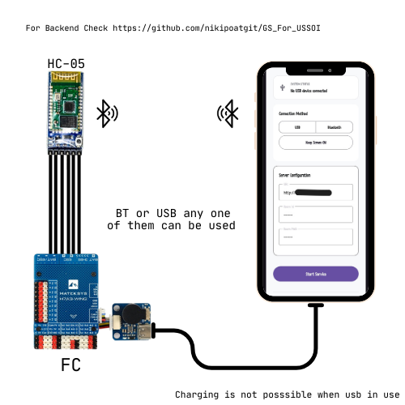
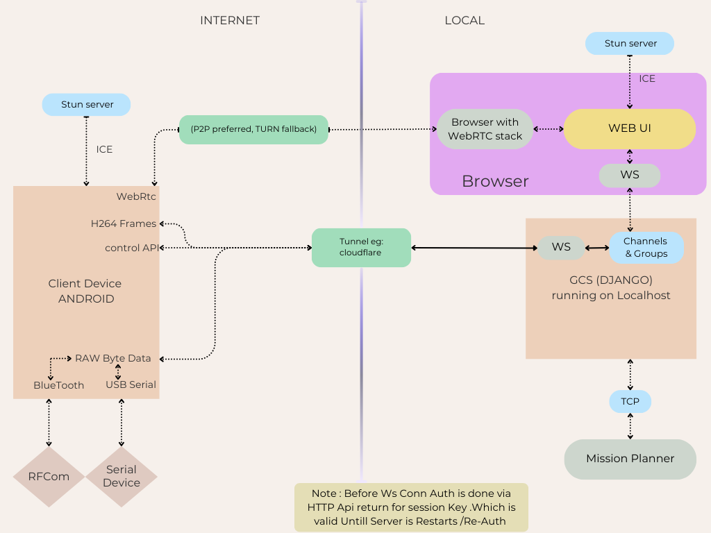
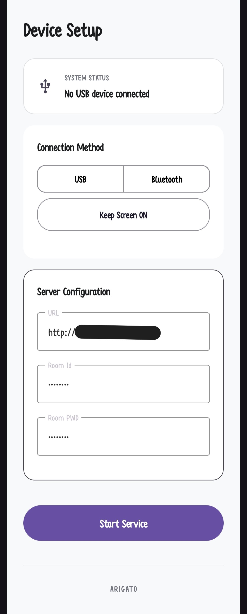
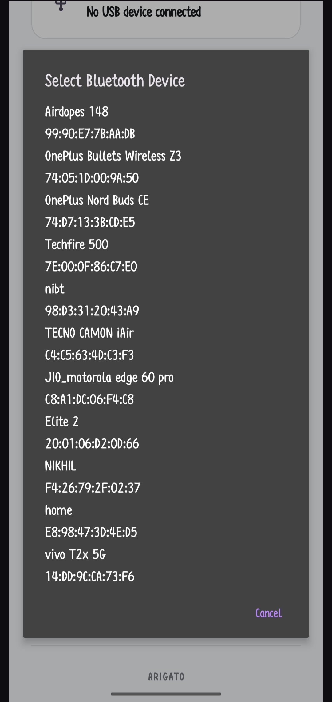

# USSOI-CAM

> **⚠️ Important Note:**
> *  See https://github.com/nikipoatgit/USSOI-CAM for Android Client  
> *  See https://github.com/nikipoatgit/GS_For_USSOI for Host Implementation
> *  See https://github.com/nikipoatgit/FlightController_H743 if want make ur own FC

#### Future Updates
- Ability to Change UART Tunnel IP/URL
- Support for Multiple BT Modules (1-3)
- P2P Connection Support (via NAT Traversal)

### Purpose
- USSOI-CAM provides an affordable alternative to dedicated digital camera and telemetry systems. It enables live camera feed and telemetry forwarding from Android devices to  ground server, delivering the core functionality required for lightweight UAS/CAM deployments.` This project prioritizes cost-effectiveness and simplicity  `.it may not include all features available in commercial products. See the documentation for known limitations and configuration options.


#
 

## 📑 Table of Contents
- [Documentation](https://github.com/nikipoatgit/USSOI-CAM/wiki)
- [System Architecture](#system-architecture)
- [App Features](#app-features)
- [API Endpoints](#api-endpoints)
- [Getting Started](#get-started )
---

##  System Architecture




## APP Features
* **Background Operation:** The service runs persistently in the background, even when the screen is off. A persistent notification is required by Android to maintain this functionality.
* **Authentication:** Credentials must be configured via the GS login interface before the application can establish WebSocket connections to the Ground Server.
( Default values roomId : nikipo, roomPwd : nikipo ).


## API Endpoints

HTTP
- Endpoint: `http://<host>/authentication`
- Method: `POST`
- Description: Client login — returns a long-lived `sessionKey` required for WebSocket connections.
- Example response:

```json
{"sessionKey":"<non-empty-string>"}
```

WebSocket
- Endpoint: `ws://<host>/uartunnel>` for UART Tunnel
- Endpoint: `ws://<host>/control/client?sessionKey=<sessionKey>`
- Description: Connect using the `sessionKey` query parameter (alternatively send the `sessionKey` as the first message after connecting).
- After connecting the client sends periodic telemetry messages (every 5 seconds).
- Example message:

```json
{"type":"clientStats","hex":"0000320000C841FFABFFE5FF000023B95B4040585B4100889E3B69DB43D5C21F35404BCD1E6805C353409A9959408E66F13DCDCCCCCCCC2474400"}
```

Telemetry encoding

- The `hex` string encodes a binary payload. Multi-byte numeric fields use little-endian ordering.
- Byte offsets in the payload:

<div>
<table border="1" cellpadding="6" cellspacing="0">
  <thead>
    <tr>
      <th>Offset (bytes)</th>
      <th>Size</th>
      <th>Type (Little Endian)</th>
      <th>Field</th>
      <th>Description</th>
    </tr>
  </thead>
  <tbody>
    <tr><td>0–1</td><td>2</td><td>int16</td><td>Battery Current</td><td>mA, signed (− = discharging)</td></tr>
    <tr><td>2</td><td>1</td><td>uint8</td><td>Battery Level</td><td>Percentage (0–100)</td></tr>
    <tr><td>3–6</td><td>4</td><td>float32</td><td>Battery Temperature</td><td>Degrees Celsius</td></tr>
    <tr><td>7</td><td>1</td><td>uint8</td><td>Thermal Status</td><td>0–6, or 0xFF if unknown</td></tr>
    <tr><td>8–9</td><td>2</td><td>int16</td><td>Cellular RSSI</td><td>dBm</td></tr>
    <tr><td>10–11</td><td>2</td><td>int16</td><td>Wi-Fi RSSI</td><td>dBm (or −140 if not available)</td></tr>
    <tr><td>12</td><td>1</td><td>uint8</td><td>Network Type</td><td>TelephonyManager.getNetworkType()</td></tr>
    <tr><td>13</td><td>1</td><td>uint8</td><td>Data Network Type</td><td>TelephonyManager.getDataNetworkType()</td></tr>
    <tr><td>14–17</td><td>4</td><td>float32</td><td>Upload Speed</td><td>KB/s</td></tr>
    <tr><td>18–21</td><td>4</td><td>float32</td><td>Download Speed</td><td>KB/s</td></tr>
    <tr><td>22–25</td><td>4</td><td>float32</td><td>App Data Usage</td><td>MB (session)</td></tr>
    <tr><td>26–33</td><td>8</td><td>float64</td><td>Latitude</td><td>Degrees</td></tr>
    <tr><td>34–41</td><td>8</td><td>float64</td><td>Longitude</td><td>Degrees</td></tr>
    <tr><td>42–45</td><td>4</td><td>float32</td><td>Accuracy</td><td>Meters</td></tr>
    <tr><td>46–49</td><td>4</td><td>float32</td><td>Speed</td><td>m/s</td></tr>
    <tr><td>50–57</td><td>8</td><td>float64</td><td>Altitude</td><td>Meters</td></tr>
    <tr><td>58</td><td>1</td><td>uint8</td><td>Status</td><td>Level/status flags (see below)</td></tr>
  </tbody>
</table>
</div>
<br>
Status (byte 58)
<div>
<table border="1" cellpadding="6" cellspacing="0">
  <thead>
    <tr>
      <th>Bit</th>
      <th>Mask</th>
      <th>Condition</th>
    </tr>
  </thead>
  <tbody>
    <tr><td>0</td><td>0x1</td><td>Tunnel active (USB or Bluetooth)</td></tr>
    <tr><td>1</td><td>0x2</td><td>Stream running</td></tr>
    <tr><td>2</td><td>0x4</td><td>Recording</td></tr>
  </tbody>
</table>
</div>


see [Documentation](https://github.com/nikipoatgit/USSOI-CAM/wiki) for more details


## Get Started 
  * Install Application From [Release](https://github.com/nikipoatgit/USSOI-CAM/releases/) or Clone repo in Android Studios Code : `https://github.com/nikipoatgit/USSOI-CAM.git`
  * Select Buttons according to use Case :
    <div> 
      
      
    </div>

  * Illustration:    
      

## end of file 
